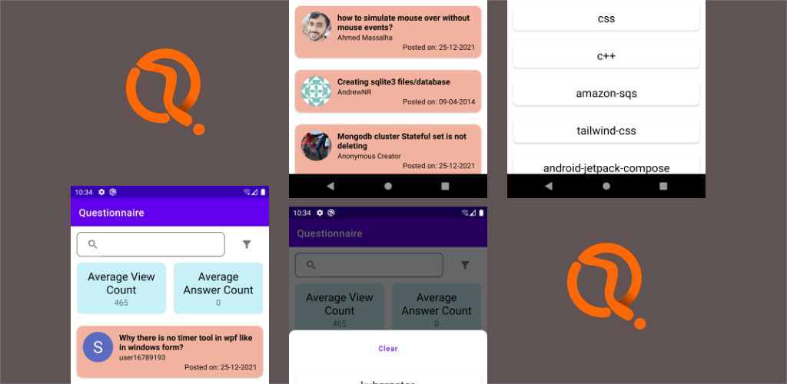

# **Questionnaire** 

## **Play Store Link**
[Download APK](https://play.google.com/store/apps/details?id=com.nishant.questionnaire)

**Questionnaire** is an Android application 📱 built using *Modern Android development* tools.

## Features
- Native Android-Kotlin application that display list of question(Question's title, Owner's Name, profile, image and Question Post Date) fetched from stackoverflow api and allow user to filter them using tags associated with questions.
- Multi type Recycler view to display advertisement/banner card.
- Filter are based on the list of tags received in API.
- Search functionality with debouncing and text Change Listener (based on question's title and owner's name)
- Click on Questions open link in web browser.

## Built With 🛠
- [Kotlin](https://kotlinlang.org/) - First class and official programming language for Android development.
- [Coroutines](https://kotlinlang.org/docs/reference/coroutines-overview.html) - For asynchronous and more.
- [Android Architecture Components](https://developer.android.com/topic/libraries/architecture) - Collection of libraries that help you design robust, testable, and maintainable apps.
  - [LiveData](https://developer.android.com/topic/libraries/architecture/livedata) - Data objects that notify views when the underlying database changes.
  - [ViewModel](https://developer.android.com/topic/libraries/architecture/viewmodel) - Stores UI-related data that isn't destroyed on UI changes. 
  - [ViewBinding](https://developer.android.com/topic/libraries/view-binding) - Generates a binding class for each XML layout file present in that module and allows you to more easily write code that interacts with views.
  - [DataBinding](https://developer.android.com/topic/libraries/data-binding) - Binds data directly into XML layouts
- [Retrofit](https://square.github.io/retrofit/) - A type-safe HTTP client for Android and Java.
- [GSON](https://github.com/google/gson) - A modern JSON library for Kotlin and Java.
- [GSON Converter](https://github.com/square/retrofit/tree/master/retrofit-converters/gson) - A Converter which uses GSON for serialization to and from JSON.
- [Coil](http://github.com/coil-kt/coil) - An image loading library for Android backed by Kotlin Coroutines.
- [Material Components for Android](https://github.com/material-components/material-components-android) - Modular and customizable Material Design UI components for Android.

## Architecture
This app uses [***MVVM (Model View View-Model)***](https://developer.android.com/jetpack/docs/guide#recommended-app-arch) architecture.

  
 ## Contact
If you need any help, you can connect with me.

Visit:- [Nishant Sharma](https://nishantsharma1115.github.io) | [LinkedIn](https://linkedin.com/in/nishantsharma1115) | [Instagram](https://www.instagram.com/_ni5hant_/) | [Facebook](https://www.facebook.com/nishant1115/)
